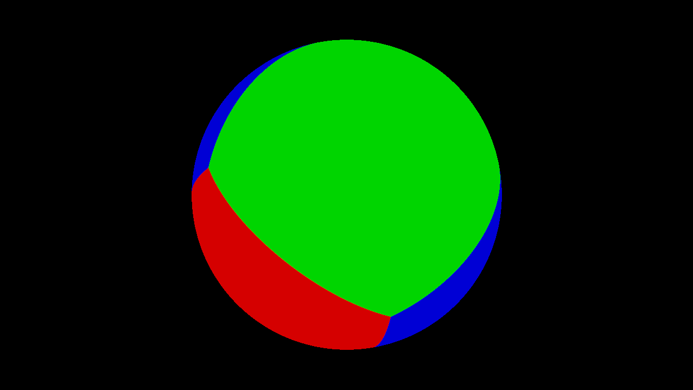
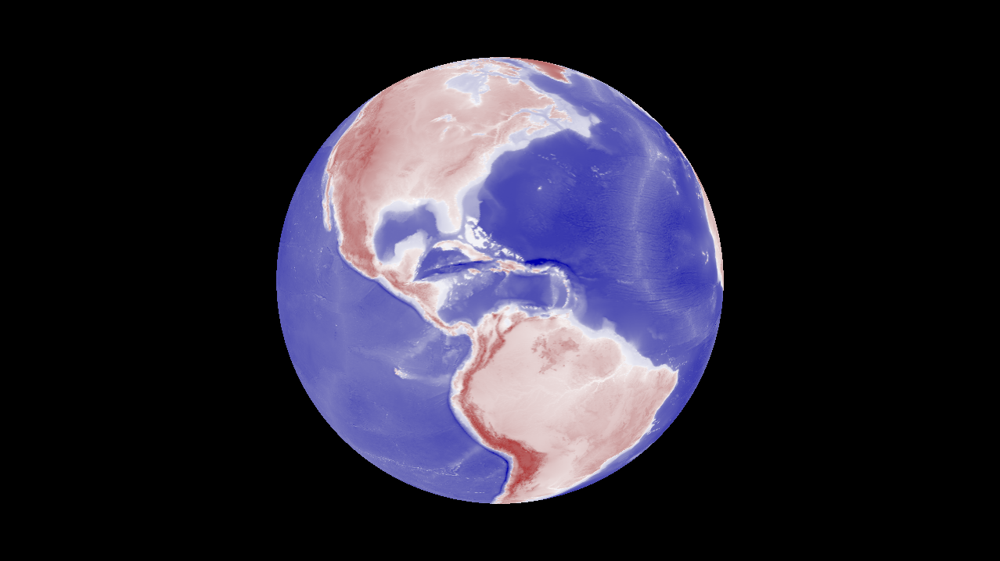
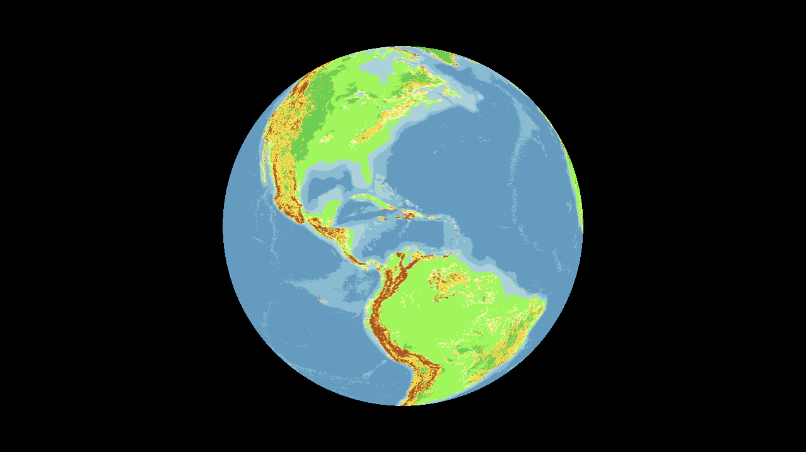

# Global Climate Model

  
  
  

## Dependencies

### Compiled

Vulkan SDK 1.3 (or later probably works too): https://vulkan.lunarg.com

### Rust

ash - version 0.38.0

ash-window - version 0.13.0

nalgebra - version 0.34.2

winit - version 0.30.13

### Python 

(optionnal, see auxiliaries)

NumPy

SciPy

Rasterio

## Description

I try to understand global climate processes and put them into a numerical model. 

More details that I will update as I go in auxiliaries/documentation/notes_0_X_X.pdf

## Usage

### Setup

Rust is straightforward enough to setup without detailled instruction, ensure you have all the required dependencies

### Controls

Camera - Click and drag.

Mousewheel - Zoom in and out

0, 1, 2 - Alternate between modes, currently: 0 - debug, 1 - Elevation, 2 - Terrain (fairly incomplete as of this version: no lakes and too little data to accurately categorize terrain for now)

## Planning

0.2.0 -  Compute pipeline + Water and atmosphere cycle (add lakes to Terrain view, add Climate view, add avg Temperature view). I'll also have a documentation file in a more polished/readable state by then or before.

0.3.0 - User Interface, maybe.

0.4.0 to 0.4.X - Biosphere cycles (carbon, nitrogen, hydrogen, oxygen, phosphorus, sulfur). Grouped for their similar short term changes, most likely added one at a time.

later - The other cycles, covering longer timeframe, such as geological, methane and CO2, marine processes that aren't thermodynamics, etc.

1.0.0 - Version I will use when I have determined the project accomplished it's goal and I am no longer actively working on it. This won't mean it will be a finished model or complete by any means, it will only be an indefinite hiatus.

I put no deadlines on any of these versions, as I have limited knowledge of what I'm doing.